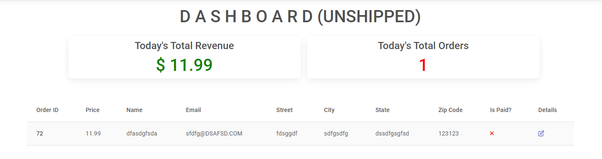

# The Pizza Place - Introduction

**The Pizza Pace** Restaurant delivery app created using the Django framework that allows for the creation, reading, updating and deleting of data to a database. 


You can view the live site here:- https://incredible-india.herokuapp.com/


----

## [Content](#content)
- [Incredible India - Introduction](#incredible-india---introduction)
  - [User Experience - UX](#user-experience---ux)
    - [Site Aims](#site-aims)
    - [Agile Methodology](#agile-methodology)
      - [Epics and User Stories](#epics-and-user-stories)
      - [Tasks](#tasks)
  - [Design](#design)
    - [Colours](#colours)
    - [Typography](#typography)
    - [Imagery](#imagery)
    - [Wireframes](#wireframes)
  - [Database Diagram](#database-diagram)
  - [Features](#features)
    - [Home Page](#home-page)
      - [Navbar](#navbar)
      - [Hero Image](#hero-image)
      - [Destination Section](#destination-section)
      - [Footer](#footer)
    - [User Page](#user-page)
    - [About Page](#about-page)
    - [Blog Page](#blog-page)
      - [Blog Details](#blog-details)
      - [Blog Comments](#blog-comments)
    - [Register](#register)
    - [Login](#login)
    - [Logout](#logout)
    - [Destinations](#destinations)
    - [Search Button](#search-button)
    - [Alert Messages](#alert-messages)      
  - [Admin Panel/Superuser](#admin-panelsuperuser)
  - [Technologies Used](#technologies-used)
    - [Languages Used](#languages-used)
    - [Django Packages](#django-packages)
    - [Frameworks - Libraries - Programs Used](#frameworks---libraries---programs-used)
  - [Testing](#testing)
      - [Validation](#validation)
      - [Manual Testing](#manual-testing)
  - [Bugs](#bugs)
      - [Fixed Bugs](#fixed-bugs)
      - [Unfix Bugs](#unfix-bugs)
  - [Deployment](#deployment)
      - [Creating the Django project](#creating-the-django-project)
      - [Creating Heroku app](#creating-heroku-app)
      - [Set up Environment Variables](#set-up-environment-variables)
      - [Heroku deployment](#heroku-deployment)
      - [Final Deployment](#final-deployment)
  - [Credits](#credits)
    - [Content](#content)
    - [Information Sources / Resources](#information-sources--resources)
  - [Acknowledgement](#acknowledgement)

-----

# User Experience - UX

## Site Aims

* The pizza place is a website designed to allow customers to view the menu and order food. 
* The website navigation and appearance is designed to be simple and easy to use.
* This website allows the user add and remove items from their order as well as allowing the site admin to add and remove menu items.
* The site allows the admin to create, read update and delete data in the database.

## User Stories

User stories were utalised to create realisitic scenarios and appropriate features to delivery to the user's needs. 


A common theme in the user stories is the need for convience when ordering food. For this reason the navigation of the website must remain simple to allow 
for quick and simple navigation. It should also always be possible for the user to make an order from any page of the website. A link placed in the footer and header will allow for this. The point here is to make the process of tranacting on the website as frictionless as possible

### Website UI
Epic Goals for User- 
* A simple and easy to navigate user interface.
* The uses and functions of the website are immediataly obvious to the user on the landing page.
* Have easy and quick asses to the menu and the corresponding menu items description.
* Search bar to allow for quicker on site navigation.

### Registration and Account Management
* Quick and simple account creation. 
* Allow admin to easily create, read, update and delete menu items from the data base.
* Allow admin accounts to be created and removed.

### Admin Management
* Create / Update / Read / Delete menu items, descriptions.
* View a history of admin actions taken.
* Add and remove user accounts.

[Back to top](#content)

## Design

### Typography

Italiana was used throughout with a backup of sans-serif. It was chosen because it relates to ehe Italian style and menu selection of the restaurant.

### Imagery

All images were sources from pexels.com. They were seleted for their appealing and accurate representation of the menu items. 

### Wireframes
The wireframes were created using Figma.


----

# Features

## Home Page

The homepage offers a stylish view of the restaurant and allows for easy access to the order page.


----

## About Page

The about page gives a simple description of the restaurant and the Italian theme of the menu.


----

## Menu Page

The menu page shows all the menu items along with their description. 


## Admin Page

Here the admin has access to the CRUD (create, read, update, delete) functionality of the website. The admin can manage the user accounts, menu items, categories and social accounts for all users of the site.


## Order Page

The order page allows the user to select menu items, input their customer details and address and proceed to the order confrimation page.


## Order Confirmation

The order confirmation gives the user an overview of the items ordered and a cash total. The user is also promted 
to either pay through PayPal or with cash upon delivery.


## Cafe login and Dashboard Page

The cafe login button in the footer grants access to the dashboard page.


The dashboard page allows employees of the restaurant access to the websites records , with a running total of
the revenue and a history of orders that have been filled.



## Search Bar 

On the top right corner, a search input field is provided along with a button to submit. This allows the user to try and find the post they are looking for.


## Technologies Used

### Languages Used

* [HTML 5](https://en.wikipedia.org/wiki/HTML/)- Used to structure all the templates on the site
* [CSS 3](https://en.wikipedia.org/wiki/CSS)- to provide extra styling to the site
* [JavaScript](https://www.javascript.com/)- Minimum javascript was used to fade out alerts after a few seconds.
* [Python](https://www.python.org/)- To provide the functionality to the site. Packages used in the project can be found in requirements.txt

### Django Packages

* [Gunicorn](https://gunicorn.org/)- As the server for Heroku.
* [Cloudinary](https://cloudinary.com/)- Was used to host the static files and media for the site.
* [Dj_database_url](https://pypi.org/project/dj-database-url/)- To parse the database URL from the environment variables in Heroku.
* [Psycopg2](https://pypi.org/project/psycopg2/)- As an adaptor for Python and PostgreSQL databases.
* [Summernote](https://summernote.org/)- As a text editor.
* [Allauth](https://django-allauth.readthedocs.io/en/latest/installation.html)- For authentication, registration, account management.
* [Crispy Forms](https://django-crispy-forms.readthedocs.io/en/latest/)- To style the forms.

### Frameworks - Libraries - Programs Used

* [Django](https://www.djangoproject.com/) was used as the framework for the back-end logic of the project. Django enables rapid and secure development.
* [Bootstrap](https://getbootstrap.com/)- Used to style the website, add responsiveness and interactivity.
* [Git](https://git-scm.com/)- Used for version control by utilizing the Gitpod terminal to commit to Git and push to GitHub.
* [GitHub](https://github.com/)- Used to store the project's code after being pushed from Git.
* [Heroku](https://id.heroku.com)- Used to deploy the live project.
* [PostgreSQL](https://www.postgresql.org/)- Database used through heroku.
* [Balsamiq](https://balsamiq.com/)- To build the wireframes for the project.
* [Google Chrome Developer Tools](https://developers.google.com/web/tools/chrome-devtools) was used to inspect page elements, debug, troubleshoot and test features and adjust property values. Using the Lighthouse extension installed in Chrome Browser, the performance report was generated.
* [Google Fonts:](https://fonts.google.com/) used for the Roboto font
* [Font Awesome:](https://fontawesome.com/) was used to add icons for aesthetic and UX purposes.

-----

[Back to top ⇧](#content)

## Testing

### Validation
I used the following validation tools to validate HTML, CSS, PYTHON codes. Below the link of TESTING.md file, which includes all validation results.  
- HTML using [W3C HTML validator](https://validator.w3.org/)
- CSS using [Jigsaw CSS validator](https://jigsaw.w3.org/css-validator/)
- Python via [PEP8 CI Python Linter](https://pep8ci.herokuapp.com/)

### Manual Testing
Testing has taken place continuously throughout the development of the project. Each view was tested regularly. When the outcome was not as expected, debugging took place at that point. An exhaustive list of features were checked on different devices and browsers. They were performed and their scrrenshots can be found in the features section on how the distinct features render. All clickable links redirect to the correct pages.

- Link for TESTING.md file:- [Testing Results Here](TESTING.md)

----

## Bugs

| **Bug** | **Fix** |
| ----------- | ----------- |
| In navbar, the menu item destination dropdown was not populating.| Create destination_list view that return context (destination_list) then add `'blog.views.destinations_list'` in templates section in settings.py file |
| Post image was not rendering on post_detail page(Issue only for mobile screens). | Remove class 'd-none' from post_detail page |
| Alert messages was not disappeare after setTimeOut(2000)<br><details><summary>Alert Code</summary></details> | Copy code from bootstrap alert and customize with forEach <br><details><summary>New Alert Code</summary></details>|
| Destination dropdown was again not populating. | Remove script scr 'bootstrap.min.js' because there is already 'bootstrap.bundle.min.js' |
| Automated test was not working because of postgres database | Connect with local db.sqlite3 while running unit test<br><details><summary>Override database for unit test</summary></details>  |


| **Unfix Bug** |
| ----------- | 
| When a logged in user adds a new post, the post slug should automatically be created from the post title. But the slug field is empty in the database. Slug is a required field when admin publishes a draft post, so here admin manually filled the slug field during publishing. Below is the screenshot from the post model in admin panel and view for Add Post.<br><details><summary>Empty slug screenshot</summary></details><details><summary>Add Post View</summary></details> 

----

## Future Implementation

* Automated testing for views functions 
* Adding and displaying replies below corresponding comments on our blog

[Back to top ⇧](#content)


## Deployment

### 1. Creating the Django Project
* Go to the Code Institute Gitpod Full Template [Template](https://github.com/Code-Institute-Org/gitpod-full-template).
* Click on `Use This Template` button, then create new repository.
* Name our repository and click on `Create repository from template` button.
* Once the template is available in your repository click on `Gitpod` button.
* When the image for the template and the Gitpod are ready, open a new terminal to start a new Django App.
* Install Django and gunicorn: `pip3 install 'django<4' gunicorn`.
* Install supporting database libraries dj_database_url and psycopg2 library: `pip3 install dj_database_url==0.5.0 psycopg2`.
* Install Cloudinary libraries to manage static files: `pip install dj-3-cloudinary-storage`.
* Create file for requirements: `pip freeze --local > requirements.txt`.
* Create project:`django-admin startproject project_name .`.
* Create app: `python manage.py startapp app_name`.
* Add app to list of `installed apps` in settings.py file: `'app_name'`.
* Migrate changes: `python manage.py migrate`.
* Test server works locally: `python manage.py runserver`.
* If the app has been installed correctly the window will display- The install worked successfully! Congratulations!

### 2. Create your Heroku app
* Navigate to [Heroku](https://id.heroku.com).
* Create a Heroku account by entering your email address and a password (or login if you have one already).
* Activate the account through the authentication email sent to your email account.
* Click the **new button** on the top right corner of the screen and select create a new app from the dropdown menu.
* Enter a unique name for the application.
* Select the appropriate region for the application.
* Click create app.
* Click Reveal Config Vars and add a new record with `DATABASE_URL`.
* Click Reveal Config Vars and add a new record with `PORT`.
* Click Reveal Config Vars and add a new record with the `DISABLE_COLLECTSTATIC = 1`(note: this must be either removed or set to 0 for final deployment).
* Next, scroll down to the Buildpack section, click `Add Buildpack` select python and click Save Changes.

### 3. Set up Environment Variables
* In you IDE create a new env.py file in the top level directory.
* Add env.py to the .gitignore file.
* In env.py import the os library.
* In env.py add `os.environ["DATABASE_URL"]` = "Paste the link copied from Heroku DATABASE_URL".
* In env.py add `os.environ["SECRET_KEY"] = "Make up your own random secret key"`.
* In Heroku Settings tab Config Vars enter the same `SECRET_KEY` created in env.py by entering 'SECRET_KEY' in the box for 'KEY' and your randomly created secret key in the 'value' box.

### 4. Setting up settings.py
* In your Django 'settings.py' file type:

 ```
 from pathlib import Path
 import os
 import dj_database_url

 if os.path.isfile("env.py"):
  import env
 ```
* Remove the default insecure secret key in settings.py and replace with the link to the secret key variable in Heroku by typing: `SECRET_KEY = os.environ.get(SECRET_KEY)`
* Comment out the `DATABASES` section in settings.py and replace with:
```
DATABASES = {
  'default': 
  dj_database_url.parse(os.environ.get("DATABASE_URL"))
  }`
```
* Create a Cloudinary account and from the 'Dashboard' in Cloudinary copy your url into the env.py file by typing: `os.environ["CLOUDINARY_URL"] = "cloudinary://<insert-your-url>"`
* In Heroku, click Reveal Config Vars and add a new record with the `CLOUDINARY_URL`
* Add Cloudinary libraries to the installed apps section of settings.py file:
 ```
 'cloudinary_storage'
 'django.contrib.staticfiles''
 'cloudinary'
 ```
* Connect Cloudinary to the Django app in `settings.py`:
```
STATIC_URL = '/static'
STATICFILES_STORAGE = 'cloudinary_storage.storage.StaticHashedCloudinaryStorage'
STATICFILES_DIRS = [os.path.join(BASE_DIR, 'STATIC')]
STATIC_ROOT = os.path.join(BASE_DIR, 'staticfiles')
MEDIA_URL = '/media/'
DEFAULT_FILE_STORAGE =
'cloudinary_storage.storage.MediaCloudinaryStorage'
* Link file to the templates directory in Heroku 
* Place under the BASE_DIR: TEMPLATES_DIR = os.path.join(BASE_DIR,
'templates')
```
* Change the templates directory to TEMPLATES_DIR. Place within the TEMPLATES array: `'DIRS': [TEMPLATES_DIR]`
* Add Heroku Hostname to ALLOWED_HOSTS: 
```ALLOWED_HOSTS = ['<Heroku_app_name>.herokuapp.com', 'localhost']```
* Create Procfile at the top level of the file structure and insert the following:
    ``` web: gunicorn PROJECT_NAME.wsgi ```

* Commit and push the code to the GitHub Repository.

### 5. Heroku Deployment: 
* Click Deploy tab in Heroku.
* Select Github as the deployment method.
* Confirm you want to connect to GitHub.
* Search for the repository name and click the connect button to link the heroku app with the Github repository. The box will confirm that heroku is connected to the repository.
* Scroll to the bottom of the deploy page and select the preferred deployment type.
* Click either Enable Automatic Deploys for automatic deployment when you push updates to Github or To manually deploy click the button 'Deploy Branch'. The default 'main' option in the dropdown menu should be selected in both cases. When the app is deployed a message 'Your app was successfully deployed' will be shown. Click 'view' to see the deployed app in the browser.

### 6. Final Deployment
In the IDE:
* When development is complete change the debug setting to: `DEBUG = False` in `settings.py` 
* In Heroku settings config vars change the `DISABLE_COLLECTSTATIC` value to 0
* Because DEBUG must be switched to True for development and False for production it is recommended that only manual deployment is used in Heroku. 
* To manually deploy click the button 'Deploy Branch'. The default 'main' option in the dropdown menu should be selected in both cases. When the app is deployed a message 'Your app was successfully deployed' will be shown. Click 'view' to see the deployed app in the browser.

----

[Back to top](#content)

# Credits

## Code
- The basic set up of the website was done by strictly following the steps as described in Code Institue Full Stack Frameworks module - Django walkthrough project `"I Think Therefore I Blog"`.
- Followed the project of one of my friend who is also a CI student (Roshana Vakeel): https://github.com/RoshnaVakkeel/Little_Learners_Lab_Logs/blob/main/logs/forms.py 
- Another project link I found from Linkdin, also CI's student (Laura Mayock): https://github.com/LauraMayock/The-happy-reader
- [The Newsbox](https://github.com/rashdogg74/newsbox86)- One of the project shared by my cohort facilitator on Slack. 

## Learning Resources
- Code Institutes Full Stack Framework Module, mainly the 'blog' walkthrough project.
- Youtube videos by [Codemy](https://www.youtube.com/watch?v=6-XXvUENY_8&list=PLCC34OHNcOtr025c1kHSPrnP18YPB-NFi&index=5)
- [W3CSchool](https://www.w3schools.com/django/)
- [Django Documentation](https://docs.djangoproject.com/en/3.2/ref/models/fields/#field-types)(For different quaries while doing project. For example query about models, fields, form widgets, auth and many more)
- Other open source to understand and solve following types of error : UnboundedLocalError, MultivalueDictKeyError,  ProgrammingError, InvalidCursorName etc.
- Youtube videos [The Dumbfounds](https://www.youtube.com/playlist?list=PLbpAWbHbi5rMF2j5n6imm0enrSD9eQUaM) for automated testing.

## Content and Media

Mostly images and post content are taken from the website https://www.holidify.com/ and https://www.incredible-india.org/. Some images are taken from [Pexels](https://www.pexels.com/).

----

## Acknowledgement

Special thanks to my mentor Sandeep Aggarwal, My fellow student Roshna, Tutor support and Slack community for their assistance throughout this project.

[Back to top](<#content>)
   