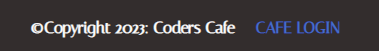

# The Pizza Place - Introduction

**The Pizza Pace** Restaurant delivery app created using the Django framework that allows for the creation, reading, updating and deleting of data to a database. 

You can view the live site here:- https://

## [Content](#content)
- [The Pizza Place - Introduction](#the-pizza-place---introduction)
  - [User Experience - UX](#user-experience---ux)
    - [Site Aims](#site-aims)
  - [Design](#design)
    - [Typography](#typography)
    - [Imagery](#imagery)
    - [Wireframes](#wireframes)
  - [Features](#features)
    - [Home Page](#home-page)
      - [About Page](#about-page)
      - [Menu Page](#menu-page)
      - [Admin Page](#admin-page)
      - [Order Page](#order-page)
      - [Order Confirmation Page](#order-confirmation-page)
      - [Cafe Login and Dashboard Page](#cafe-login-and-dashboard-page)
      - [Search Bar](#search-page)
  - [Technologies Used](#technologies-used)
    - [Languages Used](#languages-used)
    - [Django Packages](#django-packages)
    - [Frameworks - Libraries - Programs Used](#frameworks---libraries---programs-used)
  - [Testing](#testing)
      - [Validation](#validation)
      - [Manual Testing](#manual-testing)
  - [Acknowledgement](#acknowledgement)

-----

# User Experience - UX

## Site Aims

* The pizza place is a website designed to allow customers to view the menu and order food. 
* The website navigation and appearance is designed to be simple and easy to use.
* This website allows the user add and remove items from their order as well as allowing the site admin to add and remove menu items.
* The site allows the admin to create, read update and delete data in the database.

## User Stories

User stories were utalised to create realisitic scenarios and appropriate features to delivery to the user's needs. 

A common theme in the user stories is the need for convience when ordering food. For this reason the navigation of the website must remain simple to allow 
for quick and simple navigation. It should also always be possible for the user to make an order from any page of the website. A link placed in the footer and header will allow for this. The point here is to make the process of tranacting on the website as frictionless as possible

### Website UI
Epic Goals for User- 
* A simple and easy to navigate user interface.
* The uses and functions of the website are immediataly obvious to the user on the landing page.
* Have easy and quick asses to the menu and the corresponding menu items description.
* Search bar to allow for quicker on site navigation.

### Registration and Account Management
* Quick and simple account creation. 
* Allow admin to easily create, read, update and delete menu items from the data base.
* Allow admin accounts to be created and removed.

### Admin Management
* Create / Update / Read / Delete menu items, descriptions.
* View a history of admin actions taken.
* Add and remove user accounts.

[Back to top](#content)

## Design

### Typography

Italiana was used throughout with a backup of sans-serif. It was chosen because it relates to ehe Italian style and menu selection of the restaurant.

### Imagery

All images were sources from pexels.com. They were seleted for their appealing and accurate representation of the menu items. 

### Wireframes
The wireframes were created using Figma.

### Entity Relationship Diagram

This is a visual representation of the database schema.

----

# Features

## Home Page

The homepage offers a stylish view of the restaurant and allows for easy access to the order page.

----

## About Page

The about page gives a simple description of the restaurant and the Italian theme of the menu.

----

## Menu Page

The menu page shows all the menu items along with their description. 

## Admin Page

Here the admin has access to the CRUD (create, read, update, delete) functionality of the website. The admin can manage the user accounts, menu items, categories and social accounts for all users of the site.

## Order Page

The order page allows the user to select menu items, input their customer details and address and proceed to the order confrimation page.

## Order Confirmation

The order confirmation gives the user an overview of the items ordered and a cash total. The user is also promted 
to either pay through PayPal or with cash upon delivery.

## Cafe login and Dashboard Page

The cafe login button in the footer grants access to the dashboard page.

The dashboard page allows employees of the restaurant access to the websites records , with a running total of
the revenue and a history of orders that have been filled.

## Search Bar 

On the top right corner, a search input field is provided along with a button to submit. This allows the user to try and find the post they are looking for.

## Technologies Used

### Languages Used

* [HTML 5](https://en.wikipedia.org/wiki/HTML/)
* [CSS 3](https://en.wikipedia.org/wiki/CSS)
* [JavaScript](https://www.javascript.com/)
* [Python](https://www.python.org/)

### Django Packages

* [Pillow](https://pypi.org/project/Pillow/)
* [Summernote](https://summernote.org/)
* [Allauth](https://django-allauth.readthedocs.io/en/latest/installation.html)
* [Crispy Forms](https://django-crispy-forms.readthedocs.io/en/latest/)

### Frameworks - Libraries - Programs Used

* [Django](https://www.djangoproject.com/)
* [Bootstrap](https://getbootstrap.com/)
* [GitHub](https://github.com/)
* [Balsamiq](https://balsamiq.com/)
* [Google Chrome Developer Tools](https://developers.google.com/web/tools/chrome-devtools) 
* [Google Fonts:](https://fonts.google.com/)
* [Font Awesome:](https://fontawesome.com/)

-----

[Back to top ⇧](#content)

## Testing

### Validation
I used the following validation tools to validate HTML, CSS, PYTHON codes. Below the link of TESTING.md file, which includes all validation results.  
- HTML using [W3C HTML validator](https://validator.w3.org/)
- CSS using [Jigsaw CSS validator](https://jigsaw.w3.org/css-validator/)

## Future Implementation

* Automated testing for views functions 
* Adding and displaying replies below corresponding comments on our blog

[Back to top ⇧](#content)

## Content and Media

All images are taken from [Pexels](https://www.pexels.com/).

----

## Acknowledgement

I'd like to thank Richey my tutor for all his help, I couldn't of done it without him.

[Back to top](<#content>)
   